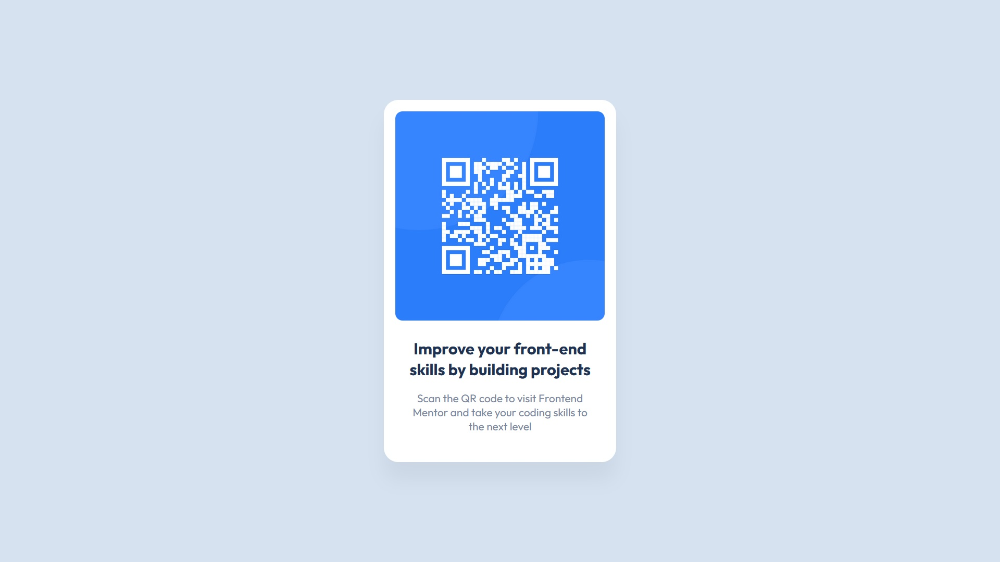

# Frontend Mentor - QR code component solution

This is a solution to the [QR code component challenge on Frontend Mentor](https://www.frontendmentor.io/challenges/qr-code-component-iux_sIO_H). Frontend Mentor challenges help you improve your coding skills by building realistic projects. 

## Table of contents

- [Overview](#overview)
  - [Screenshot](#screenshot)
  - [Links](#links)

## Overview

### Screenshot

### Links

- Solution URL: [https://github.com/CarlosSimon02/web-dev-challenges/edit/main/qr-code-component-main](https://github.com/CarlosSimon02/web-dev-challenges/edit/main/qr-code-component-main)
- Live Site URL: [https://fem-qr-code-component-challenge.vercel.app/](https://fem-qr-code-component-challenge.vercel.app/)

This is where you can give a hat tip to anyone who helped you out on this project. Perhaps you worked in a team or got some inspiration from someone else's solution. This is the perfect place to give them some credit.

**Note: Delete this note and edit this section's content as necessary. If you completed this challenge by yourself, feel free to delete this section entirely.**
