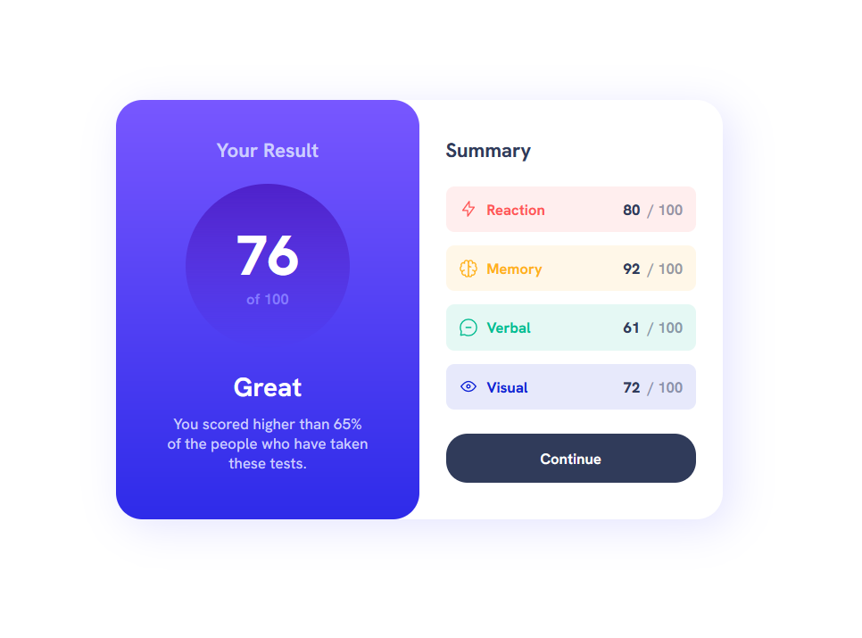

# Frontend Mentor - Results summary component solution

This is a solution to the [Results summary component challenge on Frontend Mentor](https://www.frontendmentor.io/challenges/results-summary-component-CE_K6s0maV). Frontend Mentor challenges help you improve your coding skills by building realistic projects. 

## Table of contents

- [Overview](#overview)
  - [The challenge](#the-challenge)
  - [Screenshot](#screenshot)
  - [Links](#links)
- [My process](#my-process)
  - [Built with](#built-with)
  - [What I learned](#what-i-learned)
  - [Continued development](#continued-development)
- [Author](#author)

## Overview

### The challenge

Users should be able to:

- View the optimal layout for the interface depending on their device's screen size
- See hover and focus states for all interactive elements on the page

### Screenshot

### Links

- Solution URL: [https://github.com/CarlosSimon02/front-end-challenges/tree/main/frontendmentor/results-summary-component-main](https://github.com/CarlosSimon02/front-end-challenges/tree/main/frontendmentor/results-summary-component-main)
- Live Site URL: [https://fem-result-summary-component.netlify.app/](https://fem-result-summary-component.netlify.app/)

## My process

### Built with

- Semantic HTML5 markup
- CSS custom properties
- Flexbox
- CSS Grid
- Mobile-first workflow

### What I learned

It is quite a long time since I had a front end challenge, this project helped me recall some of the things but I am still on the stage of remembering them.   

### Continued development

It is not enough to just know all the properties in css and html, but also, it is vital to know when and where I should use them. I should also go dive deeper to their mechanisms because there are times that it showed unexpected behaviour just like what happened in this project.

## Author

- Frontend Mentor - [@CarlosSimon02](https://www.frontendmentor.io/profile/CarlosSimon02)
